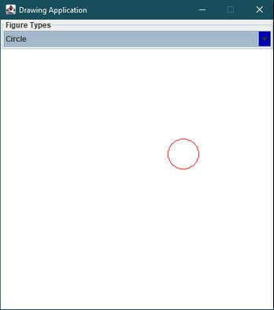
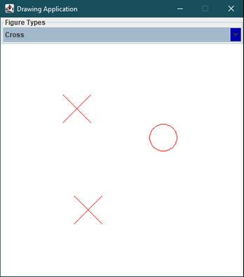
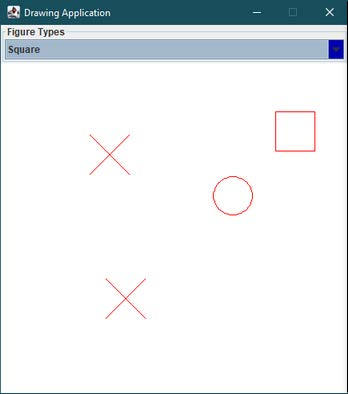
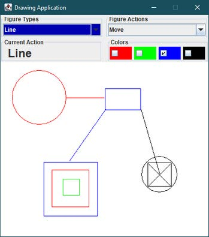

### Submission Date

4.00pm, Friday, Week 12

## Description

The application creates a 450×500 frame which uses border layout (`NORTH` and `CENTER`) to fill its area with two
panels:

1. a *control panel* containing a `JComboBox` *choice menu* for figure selection, and a `JComboBox`
   *actions menu* for selecting actions to perform on the figures, (for example, *enlarge*, *move*,
   *delete*). These are laid out in a grid with vertical and horizontal gaps of 5 pixels.
2. An *information* and *color panel* also laid out in a grid with vertical and horizontal gaps of 5 pixels.
3. a *drawing panel* with no layout (use `setLayout(null)` on the panel). The type of figure to draw is selected via a
   choice menu. Properties of figures (color, size etc.)
   can be set (see Stage 2) and figures can be manipulated (see Stage 3). Clicking (perhaps several times) in the
   drawing panel will cause the figure to be drawn with the top left-hand corner of its bounding rectangle positioned at
   the coordinates of the mouse click. The type of figure drawn is dictated by the current action label. The application
   is terminated by clicking the frame’s close button.

### Aims and Objectives

> In attempting this assignment you will
>- gain knowledge of GUI toolkit component hierarchies,
>- gain practice with creating containers and setting out and manipulating components contained therein,
>- gain general knowledge about event driven programming and specific knowledge about Java’s event model

### Marking

|Stage | Weighting | Correctness Marks | Style Marks | Testing |
| ---- | :-------: | :--------------: | :---------: | :-----: |
|1 | 50% | 90% | 0% | 10% |
|2 | 25% | 50% | 20% | 30% |
|3 | 25% | 50% | 20% | 30% |

## Stage 1

This version has three choices for figures:

1. Circle
2. Square
3. Cross

Initially the figure choice is `CIRCLE`. The background color for the choice menu is `Color.blue.darker()`, and the
foreground color is `Color.white`

Whenever the mouse is clicked with the mouse pointer in the drawing panel, a figure is drawn with its top left-hand
bounding rectangle at that point. The type of figure drawn is dictated by the currently selected figure.

*Circles* have a diameter of 50, *squares* have a side length of 50 and *crosses* are contained in a bounding rectangle
with a width and height of 50. All figures are drawn in `Color.red` (in later stages this can be changed). For example,
after clicking in the middle of the drawing panel, the frame should look like Figure 1:



Figure 1: State of the application after clicking in the middle of the drawing panel

and the console window (standard output) should contain:

```
Starting drawing application... 
Mouse pressed at (265,141)
```

After

1. choosing “**Cross**” and
2. clicking at two different points in the drawing panel The frame should look like Figure 2 and the following output
   should have been produced:

```
   Starting drawing application... 
   Mouse pressed at (265,141)
   Choice changed to Cross 
   Mouse pressed at (111,89)
   Mouse pressed at (131,270)
```



Figure 2: State of the application after changing the figure type to “Crosss” and clicking at two different points in
the drawing panel.

After

1. choosing “**Square**” and
2. clicking in the drawing panel

The frame should look like Figure 3



Figure 3: State of the application after changing the figure type to “Square” and clicking in the drawing panel.

and the following output should have been produced:

```
   Starting drawing application... 
   Mouse pressed at (265,141)
   Choice changed to Cross 
   Mouse pressed at (111,89)
   Mouse pressed at (131,270)
   Choice changed to Square 
   Mouse pressed at (343,60)
```

### Stage 1 Guide Lines

1. Start with the skeleton available from the link to the repository you have been given.
2. Please do not change the name of any of the classes in the skeleton. You are free to declare additional classes.
3. Note that the following classes are from the **AWT** and **Swing** packages: `Frame`, `JComponent`, `JPanel`
   , `MouseAdapter`,`ActionListener`, `ActionEvent`, `ItemListener`.
4. Coordinates are expressed relative to the origin of a component (a `JPanel`, `Frame`, `JComponent` etc.).
5. Typically, the constructors for each class will need to perform various initialisations.
6. Each figure is to be represented as an individual component with its own paint method.
7. If an `ItemListener` object is added to a choice menu (using the choice menu’s `addItemListener` method), the
   `itemStateChanged` method from the `ItemListener` object will be called when an item is selected.
8. Since the drawing panel object is responsible for detecting mouse presses, its inner class `ActionHandler` extends
   `MouseAdapter` should be used to handle mouse events. Mouse press events will cause the `mousePressed` method to be
   invoked. In addition to other actions, it should output (using `System.out.println`) a message of the form:
   Mouse pressed at (`x-coordinate`,`y-coordinate`)

## Stage 2

### Stage 2 extends stage 1 so that

1. a second `Choice` menu, “Figure Actions”, is added that contains the following selections:
    - **None**: no action
    - **Delete**: the next mouse click causes those components, whose bounding rectangle contains the point of the
      click, to be deleted. If the point of the click is contained within more than one rectangle, only the least
      recently added component is deleted. The remove() method can be used to delete a component from the drawing panel.
    - **Enlarge**: the next mouse click causes the component whose bounding rectangle contains the point of the click is
      increased in size by 50%. If more than one component’s bounding rectangle contains the point then the least
      recently added component is changed in size.
    - **Shrink**: the next mouse click causes the component whose bounding rectangle contains the point of the click is
      decrease in size by 10%. If more than one component’s bounding rectangle contains the point then the most recently
      added component is changed in size.

   Whenever one of the above is selected, the next mouse click over a figure will cause the respective operation to be
   performed, and the choice menu to revert to “None” once the operation has been successfully completed.
2. A set of four, *unlabelled* `checkboxes`, all with a white foreground and with red, green, blue and black backgrounds
   respectively. Only one checkbox should be able to be selected at any one time. Initially the red checkbox should be
   selected.

   The color of the selected checkbox dictates the color in which figures are drawn.

## Stage 3

### Stage 3 extends stage 2 so that

1. A new figure, `Line`, is added to the choice of figures.
    - In **LINE** mode, a click in the drawing panel indicates the starting point of the line. As the mouse is moved a
      line appears between the starting point and the current position of the mouse. When the mouse is clicked again,
      the line is frozen in its current position.
    - The bounding rectangle of a line is the smallest rectangle which contains the line.
    - Lines *cannot* be enlarged or shrunk.
2. A new action, `Move`, is added to the choice of actions.
    - In **MOVE** mode, whenever the mouse is clicked within the bounding rectangle of a figure, the figure moves with
      the mouse until it is clicked again. The figure is then frozen at that location. If the point of the initial click
      is contained within more than one rectangle, only the ***least recently added figure** should be moved.

   The `MouseAdapter` class contains methods for enabling the mouseMoved event. **Note:**
   You should have already used this class in a previous stage.

The final application can produce a drawing like the following(see Figure 4):



Figure 4: Sample drawing that can be produced.

### Testing

You are expected to test your code thoroughly. This will include, at a minimum, **JUnit** tests for any *non-GUI
methods* and for those seeking higher grades *tests for the GUI components*.